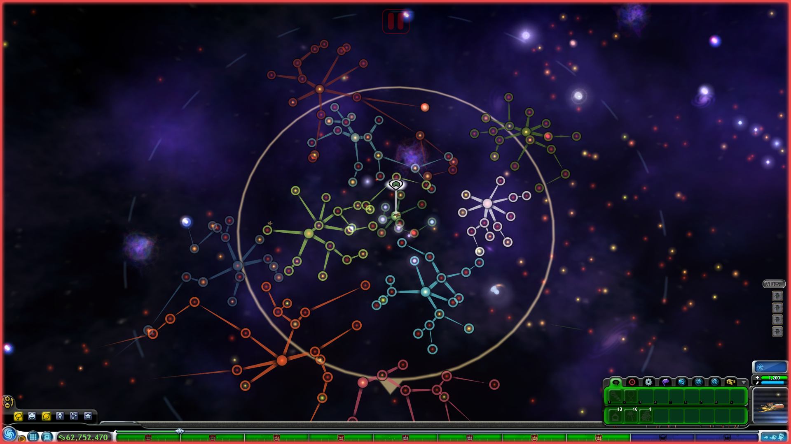
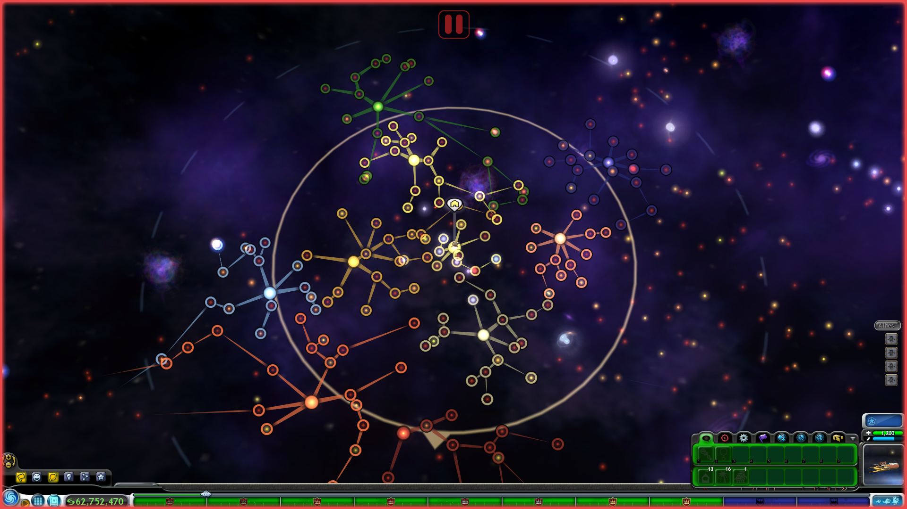
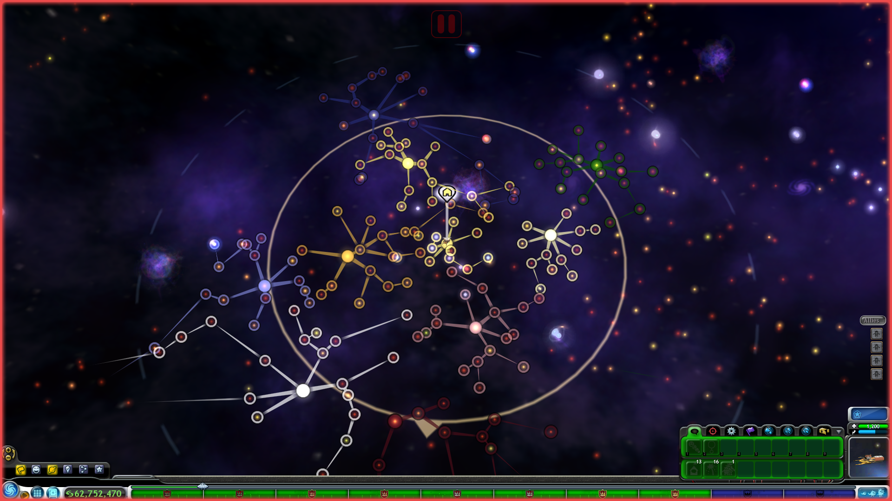
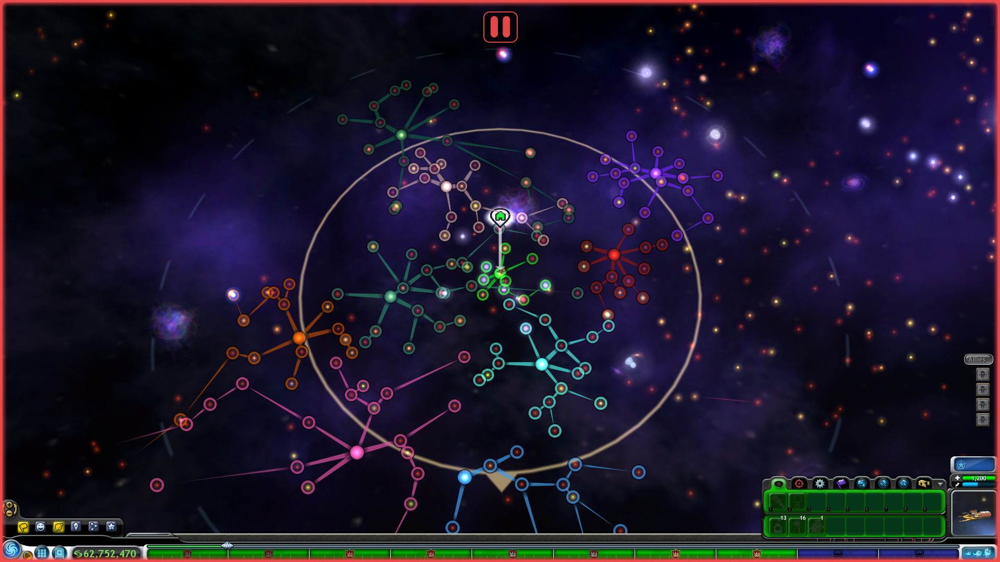
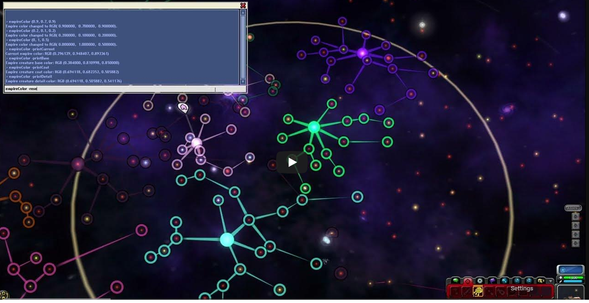

# Empire Color Customization
This mod allows empires in the Space Stage to have any color, instead of repeating the same few as in vanilla.  
It also adds a new cheat, empireColor, that gives players the ability to change the color of any empire.
### Features
- Adds the empireColor cheat command, which lets you change any empire's color to any RGB value.
- AI empires themselves can get any color as their default, not just the handful vanilla reuses.
- Custom colors are saved and persist across saves.
- Lets you choose the rule used to determine an empire's *default* color (before any custom color is applied) when installing the mod:
  - **Vanilla**: Empires keep their original vanilla default colors.
  - **Creature Base**: Empires use their creature's base color as their default color.
  - **Creature Coat**: Empires use their creature's coat color as their default color.
  - **Creature Detail**: Empires use their creature's detail color as their default color.
  - **Random**: Empires use a completely random color as their default color.
- The Grox are not affected by the chosen default color rule, but their color can still be changed with the empireColor cheat like any other empire.
## Default Color Rules
Creature Base | Creature Coat | Creature Detail | Random
:------------:|:--------------:|:----------------:|:------:
|  |  |  | 
## empireColor
`empireColor` lets you change, restore, or display empire colors from the console. For all examples, except the one that resets every empire, you must be at a star belonging to an empire.

**Examples:**

Changes the star's empire color to RGB (0.9, 0.7, 0.9). RGB values must be between 0.0 and 1.0.
```
empireColor (0.9, 0.7, 0.9)
```
Restores the star's empire default color.
```
empireColor -reset
```
Restores the default colors of all empires.
```
empireColor -resetAll
```
Prints the star's empire color.
```
empireColor -printCurrent
```
Prints the base color of the empire's creature.
```
empireColor -printBase
```
Prints the coat color of the empire's creature.
```
empireColor -printCoat
```
Prints the detail color of the empire's creature.
```
empireColor -printDetail
```

You can also type `help empireColor` in the console for this same information.

### *Video showing the empireColor command*

[](https://www.youtube.com/watch?v=cqIVXMnSo84)
## Installation
- Requires [UPE](https://github.com/Zarklord/UniversalPropertyEnhancer/releases/tag/v1.2.0).
- This mod can be installed, reinstalled, or removed in existing saves.
- Uninstalling the mod leaves behind the empireColorCustomizationDB file in Spore/Games/Game0. You can delete it manually, but leaving it there shouldn't have any negative effect.
---
